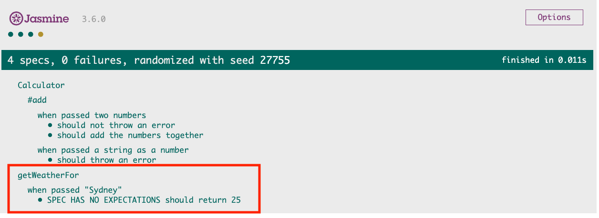
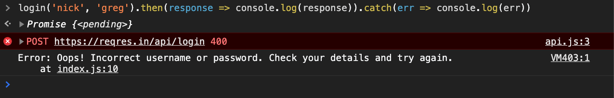
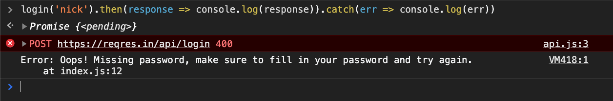

# Testing Exercises 

## Description

Now that you've learnt the basics of testing javascript with Jasmine, `git clone` this repository and get stuck into the exercises!

## Exercises

Each exercise is made up of source code available in the [src/](src/) folder.

To complete each exercise, create a matching `spec` file in the [spec/](spec/) folder, and use a `<script></script>` tag to add it to [SpecRunner.html](SpecRunner.html). The first one, [src/calculator/index.js](src/calculator/index.js), has been done for you.

Make sure to have [SpecRunner.html](SpecRunner.html) open in the browser as you go.

### 1. Calculator

In this exercise we'll be writing unit tests for [src/calculator/index.js](src/calculator/index.js).

In [spec/calculatorSpec.js](spec/calculatorSpec.js), write **unit** tests, testing each method on the `Calculator` class.

You should test both the functionality of each method **as well as** any errors methods could throw.

To test whether a function or method throws an error, we'll use the [toThrow](https://jasmine.github.io/api/3.6/matchers.html#toThrow) jasmine matcher.

This has already been done for you for the `add` method in [spec/calculatorSpec.js](spec/calculatorSpec.js). Let's take a look at the test case.

```js
describe('#add', () => {
  describe('when passed a string as a number', () => {
    it('should throw an error', () => {
      const calculator = new Calculator();

      expect(() => calculator.add('1', 2)).toThrow();
      expect(() => calculator.add(1, '2')).toThrow();
    });
  });
});
```

Notice how we pass `expect` an `arrow function`? That's because if passed the result of the function itself, the error will trigger and stop our test from running at all.

Replace the `expect` lines with the following, refresh `SpecRunner.html` and have a look at the result.

```js
expect(calculator.add('1', 2)).toThrow();
expect(calculator.add(1, '2')).toThrow();
```

You should see something like this:


See how the error has been thrown and stopped our test from running? By using an arrow function and calling our function within it, we can let `Jasmine` call our function and check if it throws.

Replace the `expect` lines back to the following, refresh `SpecRunner.html` and have a look at the result.

```js
expect(() => calculator.add('1', 2)).toThrow();
expect(() => calculator.add(1, '2')).toThrow();
```

Much better:


To complete the exercise, add unit tests for the rest of the methods on the `Calculator` class. Test that each method:

  - Returns the correct result
  - Errors when passed strings as parameters

### 2. Chance

In this exercise, we'll be testing the `headsOrTails` function from [src/chance/index.js](src/chance/index.js).

The `headsOrTails` function returns `'heads'` or `'tails'` depending on the result of `coin.flip()`, which has a 50% chance of being true or false.

Let's have a look at the included test case in [spec/chanceSpec.js](spec/chanceSpec.js).

```js
describe('headsOrTails', () => {
  describe('when the coin flip is true', () => {
    it('should return heads', () => {
      const result = headsOrTails();

      expect(result).toBe('heads');
    });
  });
})
```

Here, we're calling `headsOrTails`, storing the result into a variable `result`, and `expect`ing that variable to be `'heads'`.

Add [spec/chanceSpec.js](spec/chanceSpec.js) to `SpecRunner.html` with a `<script></script>` tag, and refresh `SpecRunner.html`.

See if the test passes. Refresh the page a few more times.

Notice how sometimes the test passes, and sometimes it doesn't?

That's because the `headsOrTails` function returns `'heads'` or `'tails'` _depending on the result of `coin.flip()`_, which has a 50% chance to be `true` or `false`! 

We call this an **external dependency**, something our function _depends_ on, but can't control.

This is known as a [flaky test](https://hackernoon.com/flaky-tests-a-war-that-never-ends-9aa32fdef359), because without changing the condition of the test, the test sometimes passes and sometimes fails.

We can handle this flaky test by modifying the behaviour of `coin.flip()` so that it always does we want it to do. We can do this using a [Spy](https://jasmine.github.io/api/3.6/Spy.html).

Let's use the [spyOn](https://jasmine.github.io/api/3.6/global.html#spyOn) function to create a `spy` that spy's on the `code.flip()` method and modifies it to behave in a predictable manner.

Replace the test case with the following:

```js
describe('headsOrTails', () => {
  describe('when the coin flip is true', () => {
    it('should return heads', () => {
      // spy on coin.flip and change its return value to always be true
      spyOn(coin, 'flip').and.returnValue(true);

      const result = headsOrTails();

      expect(result).toBe('heads');
    });
  });
})
```

Save the spec and refresh `SpecRunner.html` a few times, you should notice the test passes each time!

Go ahead and create a test for `when the coin flip is false`, expecting the `result` to be `'tails'`.

### 3. BuyBeer

In this challenge, we'll be testing [src/buyBeer/index.js](src/buyBeer/index.js).

Create a spec for the file, add the spec to `SpecRunner.html`.

First, create tests for the `canBuyBeer` function, test that the function works as expected for an `age` under 18, and for an `age` over 18.

Next, create tests for the `canGregBuyBeer` function. First, create a test as if `greg.age` is over 17.

You should notice a couple of things here:

  1. It's hard to test the result, since the `return` value of `canGregBuyBeer` includes `greg`'s `age`, which is randomly generated by the `Person` class.
  2. Sometimes `greg`'s `age` is over 18, sometimes it isn't. It's another flakey test!

What can we use to handle these cases? A [Mock](https://en.wikipedia.org/wiki/Mock_object)!

Because `age` is a property, not a function, we don't need to use a Spy to achieve a similar result, instead, we can just replace the value with what we need, and revert it back later. We call this a `Mock`.

Check out the following test case that saves a reference to `greg`'s `age`, modifies it, and restores it after.

```js
describe('canGregBuyBeer', () => {
  describe('when greg is 18', () => {
    it('should return "Greg is 18, he can buy beer!"', () => {
      const originalAge = greg.age;
      greg.age = 18
      
      const result = canGregBuyBeer();

      expect(result).toBe('Greg is 18, he can buy beer!');
      greg.age = originalAge;
    })
  });
});
```

Because we've set `greg`'s `age` to explicitly be `18`, we know that `canGrebBuyBeer` will always return the string `'Greg is 18, he can buy beer!'`.

It's important to set `greg.age` back to its original value as not to break any further tests.

Now that we've implemented a test for when greg is over 18, can you add a test case for when greg is under 18?

### 4. Weather

Before starting this exercise, refresh your self on [Promises](https://developer.mozilla.org/en-US/docs/Web/JavaScript/Reference/Global_Objects/Promise).

For this exercise, we'll be testing [src/weather/index.js](src/weather/index.js).

Create a spec for it, and link it to the `SpecRunner.html`.

We're going to write some unit tests for the function `getWeatherFor`.

We want to write the following tests to cover all our code paths in the function:
  - When we pass `'Sydney'` we get back the right temp.
  - When we pass `'Melbourne'` we get back the right temp.
  - When we pass any other city we get an error.

Because `getWeatherFor` returns a promise, we'll have to handle the fact that it is an [Asynchronous](https://developer.mozilla.org/en-US/docs/Learn/JavaScript/Asynchronous/Concepts) function.

First, let's use what we know to try and get a test to pass. Let's start with the first case: 

> When we pass `'Sydney'` we get back the right temp.

Because `getWeatherFor` returns a promise, we'll need to use `.then` to get the value, that's start with that.

```js
describe('getWeatherFor', () => {
  describe('when passed "Sydney"', () => {
    it('should return 25', () => {
      getWeatherFor('Sydney')
        .then((temp) => {
          expect(temp).toBe(25);
        });
    });
  });
});
```

Refreshing `SpecRunner.html` shows us the following:



Jasmine is telling us "SPEC HAS NO EXPECTATIONS". Even though we added an `expect`, expecting the `temp` to be `25`.

What's going on?

Well, Jasmine doesn't know it needs to _wait_ for the promise to `resolve` before it moves on. This is because `getWeatherFor` is an [Asynchronous](https://developer.mozilla.org/en-US/docs/Learn/JavaScript/Asynchronous/Concepts) function. 

There's two ways to do this with Jasmine, the first is to `return` the function `getWeatherFor`, like so: 

```js
describe('getWeatherFor', () => {
  describe('when passed "Sydney"', () => {
    it('should return 25', () => {
      return getWeatherFor('Sydney')
        .then((temp) => {
          expect(temp).toBe(25);
        });
    });
  });
});
```

The second is to use and `return` the [expectAsync](https://jasmine.github.io/api/3.6/global.html#expectAsync) function, and the [async-matcher](https://jasmine.github.io/api/3.6/async-matchers.html) `.toBeResolvedTo()`, like so.

(Notice I've changed the wording in the `it` to reflect the language used in the matcher).

```js
describe('getWeatherFor', () => {
  describe('when passed "Sydney"', () => {
    it('should resolve 25', () => {
      return expectAsync(getWeatherFor('Sydney')).toBeResolvedTo(25);
    });
  });
});
```

I prefer the second way, since it's cleaner and will help when testing when `getWeatherFor` _rejects_ (causes an error to be thrown in `.catch()`), so let's go with that for our code.

Which, by the way, is the thing we need to do for our next test case!

```js
describe('when passed a city other than "Sydney" or "Melbourne"', () => {
  it('should reject with an error', () => {
    return expectAsync(getWeatherFor('London'))
      .toBeRejectedWith('City London does not exist in our database');
  });
});
```

Here, we've used the `.toBeRejectedWith()` matcher to test that the promise _rejects_ with a value. I've also brought the matcher down a line to make it easier to read, but I could of kept it on the same line, just like

```js
return expectAsync(getWeatherFor('London')).toBeRejectedWith('City London does not exist in our database');
```

Now that we've added cases for `'Sydney'` and `'London'`, try adding a test case for `'Melbourne'`, using `expectAsync()`.

### 5. Login

For this exercise, we're going to be combining everything we've learnt so far:
  - Spies
  - Mocks
  - expectAsync and Promises

to test a "real world" example in [src/login/index.js](src/login/index.js).

First, let's go through each file:
  - [src/login/index.js](src/login/index.js): The code we're going to test
  - [src/login/api.js](src/login/api.js): An `Api` class that calls a real api to get data
  - [src/login/domElement.js](src/login/domElement.js): A `DomElement` class that mimics what we would get back from `document.querySelector()`.

We're going to test `login` together, and then we'll start testing the `clickButton` event, with the challenge to finish it off on your own!

Before you continue, create a `Spec` file for `login` and link it to `SpecRunner.html`.

Looking at the code for the `login` function:

```js
const login = (email, password) => Api.login(email, password)
  .then(response => {
    if (response.error) {
      if (response.error === 'user not found') {
        throw new Error('Oops! Incorrect username or password. Check your details and try again.');
      } else if (response.error === 'Missing password') {
        throw new Error('Oops! Missing password, make sure to fill in your password and try again.');
      }
    }

    return response.token;
  });
```
We can see it calls a function `Api.login()`, which `return`s a `promise`, giving us a `response`, which we check to see if it includes an `error`, if it does, we `throw` errors, otherwise finally `return` the `response.token`.

Phew! Let's play around with this function first to get a feel for how it works, note, `Api.login()` is requesting a _real_ api here. 

In `SpecRunner.html` in the browser, open up the console and run:

```js
login('eve.holt@reqres.in', 'greg').then(response => console.log(response)).catch(err => console.log(err))
```

Here, we're calling `login` with the `email` of `'eve.holt@reqres.in'` and the `password` `'greg'`, we should see:


Here, the login has been sucessful and returned a `token` which we logged out.

Next, let's modify our username and password a bit:

```js
login('nick', 'greg').then(response => console.log(response)).catch(err => console.log(err))
```

This should cause the API to give us back an error, looking something like:



Finally, lets take out the password completly:

```js
login('nick').then(response => console.log(response)).catch(err => console.log(err))
```

Which should give us our final error, looking something like:



Now we've gone through all the possible results from calling `login` using the _real_ API, let's go ahead and test these.

When we're testing against real APIs, to stop our code from being "flaky", its best to replace the API (which is an **external dependency**) with a [Spy](https://jasmine.github.io/api/3.6/Spy.html).

We need to make sure our `Spy` returns the same type of value that the original function returns, in this case its a promise.

With this in mind, let's implement a test to test the _happy path_ of our function, when the API returns back a `token` and no `error`.

```js
describe('login', () => {
  describe('when the user logs in successfully', () => {
    it('should resolve a token', () => {
      const response = { token: '123' };
      const loginValue = new Promise((resolve, reject) => {
        resolve(response);
      });

      spyOn(Api, 'login').and.returnValue(loginValue);

      return expectAsync(login('test', 'test')).toBeResolvedTo(response.token);
    });
  });
});
```

There's a lot going on here, but lets break it down.

First,

```js
  const response = { token: '123' };
```

We're creating a `response` object with the `response` we want the promise that `Api.login()` returns to give us.

Next,

```js
const loginValue = new Promise((resolve, reject) => {
  resolve(response);
});
```

Here we're creating the `Promise` that `Api.login()` is going to `return`. You can read up on the syntax over on the [Promise](https://developer.mozilla.org/en-US/docs/Web/JavaScript/Reference/Global_Objects/Promise) MDN article.

In short, a `new Promise()` takes a `callback`, which we can then use to `resolve` a value (that will get passed to `.then()`) or `reject` a value (that will get passed to `.catch()`).

After that,

```js
spyOn(Api, 'login').and.returnValue(loginValue);
```

We're using a spy to modify `Api.login()` to instead return our `Promise` we created (`loginValue`), instead of calling the _real_ API.

Finally,

```js
return expectAsync(login('test', 'test')).toBeResolvedTo(response.token);
```

We use `return expectAsync()` because we need to tell Jasmine to wait for our `Promise` to resolve, and we're checking it resolves to our `response.token`!

Note that, it doesn't matter what `email` or `password` we pass to `login()`, since we've used a `Spy` to _always_ resolve with our `token`.

Phew, that was a big one. Go through it a few more times if you need to, before moving on to the next case.

Now that we have tested the _happy path_ of our `login` function, let's add a test case for when the `Api.login()` function resolves with an `error`.

```js
describe('when the user uses an incorrect email', () => {
  it('should reject with an error message', () => {
    const response = { error: 'user not found' };
    const loginValue = new Promise((resolve, reject) => {
      resolve(response);
    });

    spyOn(Api, 'login').and.returnValue(loginValue);

    return expectAsync(login('test', 'test'))
      .toBeRejectedWithError('Oops! Incorrect username or password. Check your details and try again.');
  });
});
```

We'll break this one down too.

First,

```js
const response = { error: 'user not found' };
```

Similar to the previous test, but here we're setting the response to be an object with the `error` property set to `'user not found'`. This will trigger the right part of the `login` function we want to test.

Next,

```js
const loginValue = new Promise((resolve, reject) => {
  resolve(response);
});
```

Exactly the same as the previous test, we're creating a promise that we will give `Api.login()` to return using our spy. We're resolving the `response` we just created.

Then,
```js
spyOn(Api, 'login').and.returnValue(loginValue);
```

Again, same as the previous test. We're spying on `Api.login()` and setting it's `returnValue` to the `loginValue` we just created.

Finally,
```js
return expectAsync(login('test', 'test'))
  .toBeRejectedWithError('Oops! Incorrect username or password. Check your details and try again.');
```

Here we're using `return expectAsync()` like in the previous test to tell Jasmine to wait for our promise to resolve before continuing on.

The difference here is the [async-matcher](https://jasmine.github.io/api/3.6/async-matchers.html) we used. We're using `.toBeRejectedWithError()` to check that `login` _rejects_ with the correct error.

Using what you have learnt so far, write a test that tests when a `password` is not passed to `login`. It should be very similar to the previous test case!

### 6. Login: CHALLENGE - clickButton (OPTIONAL)

This exercise is a challenging one! Use all you've learnt to write tests for `clickButton` in [src/login/index.js](src/login/index.js).

Some tips:

- Use mocks for the values of the fields
- Test both the happy path and when theres an error. There's two errors here! Both from `login`
- Because the function in `.then()` on line 24 does _not_ `return` anything, we'll need to use the first stratergy we discussed when dealing with Asynchronous code.
  - Try `return`ing the function `clickButton` in your test.
  - Call `.then()` on the result of `clickButton` and use the callback provided to `.then()` to check things!, for example:
    ```js
    return clickButton.then(() => {
      expect(loginMessage.innerText).toBe('FILL THIS IN!')
    })
    ```
- Use spies to spy on `Api.login` so that the code doesn't call the API!
- Make sure you test the fields are reset!

Good luck! This is a tricky one! A completed example will be provided towards the end of the day.

### 7. Weather app: CHALLENGE (OPTIONAL)

For the final challenge, can you write tests for your weather app created last week?

Start by testing the functionality of the function that creates the HTML for the weather app.

Then, test the functionality of the function that gets the weather for a city.

Finally, for that extra challenge, try testing the click handler for your button. Note, **this is extremely difficult** so don't be discouraged if you don't get there!

